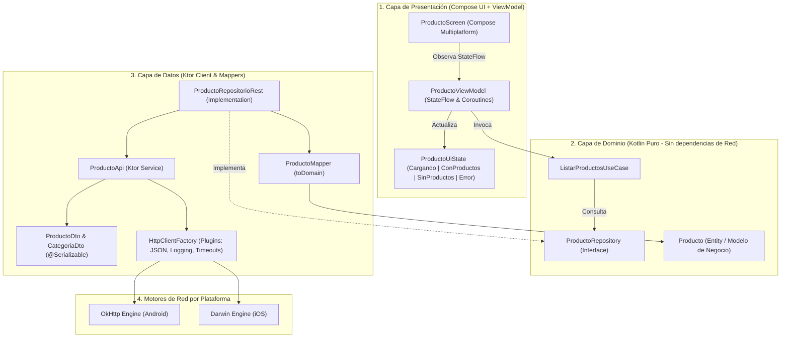

<div align="center">


# UNIVERSIDAD PERUANA UNIÓN
### FACULTAD DE INGENIERÍA Y ARQUITECTURA
**Escuela Profesional de Ingeniería de Sistemas**

---

### INFORME DE LABORATORIO — GUÍA PRÁCTICA N.º 07
# CLIENTE KTOR Y CONSUMO GET EN PHARMAMOBIL (KMP)

---

| **DATOS GENERALES** | **DETALLE** |
|:---|:---|
| **Asignatura:** | Desarrollo de Aplicaciones Móviles |
| **Ciclo y Semestre:** | VI Ciclo · Semestre 2026-2 |
| **Unidad Académica:** | Unidad 2: Conectividad, CRUD REST y persistencia multiplataforma |
| **Docente:** | Mg. David Reyna |
| **Estudiante:** | **Andrey Fidel Mestanza Bazan** |
| **Código Universitario:** | **202410351** |
| **Modalidad:** | Individual |
| **Repositorio GitHub:** | [https://github.com/17Yerdna/PharmaMobil](https://github.com/17Yerdna/PharmaMobil) |
| **Rama de Entrega:** | `feature/ktor-client` |
| **Fecha:** | 30 de setiembre de 2026 |

---

</div>

<div style="page-break-after: always;"></div>

## 1. Propósito y Objetivos de la Práctica

El propósito de la **Guía Práctica N.º 07** es implementar la conectividad de red multiplataforma mediante el cliente HTTP **Ktor Client** en la aplicación **PharmaMobil** (desarrollada con **Kotlin Multiplatform** y **Compose Multiplatform**). 

### Objetivos Específicos:
1. Configurar las dependencias de Ktor y el plugin `kotlinx.serialization` distribuidas por cada *source set* (`commonMain`, `androidMain`, `iosMain`).
2. Configurar el motor de red correspondiente para cada plataforma: **OkHttp** en Android y **Darwin** en iOS, inyectados dinámicamente mediante **Koin**.
3. Construir una fábrica centralizada `HttpClientFactory` configurando los plugins esenciales: `ContentNegotiation`, `Logging`, `HttpTimeout` y `defaultRequest`.
4. Diseñar los Data Transfer Objects (**DTO**) serializables y los mappers correspondientes hacia las entidades de dominio, garantizando el aislamiento de la arquitectura **Clean Architecture**.
5. Reemplazar el repositorio en memoria por `ProductoRepositorioRest`, conectando la capa de presentación (`ProductoViewModel` y `ProductoScreen`) al consumo real de la API REST mediante peticiones HTTP `GET`.
6. Validar el control de excepciones de red para que la interfaz responda con estados reactivos controlados (`Cargando`, `ConProductos`, `SinProductos`, `Error` con botón de reintento) sin caídas intempestivas (*crashes*).

---

## 2. Arquitectura del Sistema y Flujo de Datos

Se aplicó la arquitectura **Clean Architecture + MVVM** con **Inyección de Dependencias (Koin)**:



---

## 3. Desarrollo e Implementación Paso a Paso

### Paso 1: Configuración de Dependencias y Catálogo de Versiones

En `gradle/libs.versions.toml` se centralizó la versión `ktor = "3.1.3"` y se definieron los alias modulares:

```toml
[versions]
ktor = "3.1.3"

[libraries]
ktor-client-core = { module = "io.ktor:ktor-client-core", version.ref = "ktor" }
ktor-client-content-negotiation = { module = "io.ktor:ktor-client-content-negotiation", version.ref = "ktor" }
ktor-serialization-kotlinx-json = { module = "io.ktor:ktor-serialization-kotlinx-json", version.ref = "ktor" }
ktor-client-logging = { module = "io.ktor:ktor-client-logging", version.ref = "ktor" }
ktor-client-okhttp = { module = "io.ktor:ktor-client-okhttp", version.ref = "ktor" }
ktor-client-darwin = { module = "io.ktor:ktor-client-darwin", version.ref = "ktor" }

[plugins]
kotlinSerialization = { id = "org.jetbrains.kotlin.plugin.serialization", version.ref = "kotlin" }
```

En `shared/build.gradle.kts` se aplicó el plugin y se distribuyeron las dependencias por *source set*:

```kotlin
plugins {
    alias(libs.plugins.kotlinMultiplatform)
    alias(libs.plugins.androidMultiplatformLibrary)
    alias(libs.plugins.composeMultiplatform)
    alias(libs.plugins.composeCompiler)
    alias(libs.plugins.kotlinSerialization)
}

kotlin.sourceSets {
    androidMain.dependencies {
        implementation(libs.ktor.client.okhttp)
    }
    commonMain.dependencies {
        implementation(libs.ktor.client.core)
        implementation(libs.ktor.client.content.negotiation)
        implementation(libs.ktor.serialization.kotlinx.json)
        implementation(libs.ktor.client.logging)
    }
    iosMain.dependencies {
        implementation(libs.ktor.client.darwin)
    }
}
```

En `androidApp/src/main/AndroidManifest.xml` se añadió el permiso de Internet:
```xml
<uses-permission android:name="android.permission.INTERNET" />
```

---

### Paso 2: Motores de Red por Plataforma en Koin

Se utilizó la modularidad multiplataforma para proveer la instancia de `HttpClientEngine`:

- **Android (`PlatformModule.android.kt`):**
```kotlin
actual val platformModule: Module = module {
    single<HttpClientEngine> { OkHttp.create() }
}
```

- **iOS (`PlatformModule.ios.kt`):**
```kotlin
actual val platformModule: Module = module {
    single<HttpClientEngine> { Darwin.create() }
}
```

---

### Paso 3: Construcción y Configuración de `HttpClientFactory`

En `shared/src/commonMain/.../data/remote/HttpClientFactory.kt` se concentró toda la configuración del cliente HTTP:

```kotlin
fun crearHttpClient(engine: HttpClientEngine): HttpClient =
    HttpClient(engine) {
        expectSuccess = true

        install(ContentNegotiation) {
            json(Json {
                ignoreUnknownKeys = true
                isLenient = true
                encodeDefaults = true
            })
        }
        install(Logging) {
            logger = object : Logger {
                override fun log(message: String) {
                    println("[KtorHttp] $message")
                }
            }
            level = LogLevel.HEADERS
        }
        install(HttpTimeout) {
            requestTimeoutMillis = 15000
            connectTimeoutMillis = 10000
        }
        defaultRequest {
            url("https://api.escuelajs.co/api/v1/")
            contentType(ContentType.Application.Json)
        }
    }
```

---

### Paso 4: DTOs y Mapeo al Dominio

Se diseñó el contrato de la API en `ProductoDto.kt` y la función de transformación pura `ProductoMapper.kt`:

- **DTO (`ProductoDto.kt`):**
```kotlin
@Serializable
data class ProductoDto(
    val id: Long,
    val title: String,
    val price: Double,
    val description: String = "",
    val images: List<String> = emptyList(),
    @SerialName("category") val categoria: CategoriaDto? = null
)

@Serializable
data class CategoriaDto(
    val id: Long,
    val name: String
)
```

- **Mapper (`ProductoMapper.kt`):**
```kotlin
fun ProductoDto.toDomain(): Producto = Producto(
    id = id,
    nombre = title,
    precio = if (price > 0) price else 1.0,
    stock = 15
)
```

---

### Paso 5: Servicio Remoto y Repositorio REST

- **API Client (`ProductoApi.kt`):**
```kotlin
class ProductoApi(private val client: HttpClient) {
    suspend fun obtenerProductos(limite: Int = 10): List<ProductoDto> =
        client.get("products") {
            parameter("limit", limite)
        }.body()
}
```

- **Repositorio REST (`ProductoRepositorioRest.kt`):**
```kotlin
class ProductoRepositorioRest(
    private val api: ProductoApi
) : ProductoRepository {
    override suspend fun listar(): List<Producto> {
        return api.obtenerProductos().map { it.toDomain() }
    }

    override suspend fun registrar(producto: Producto): Producto {
        return producto.copy(id = (1000L..9999L).random())
    }
}
```

- **Inyección de Dependencias (`AppModule.kt`):**
```kotlin
val dataModule = module {
    single { crearHttpClient(get()) }
    single { ProductoApi(get()) }
    single<ProductoRepository> { ProductoRepositorioRest(get()) }
    single<ClienteRepository> { ClienteRepositorioEnMemoria() }
}
```

---

## 4. Evidencias de Ejecución y Pruebas

### 4.1. Registro de Ktor (Logcat) con Petición GET y Respuesta 200 OK

A continuación se presenta el registro en consola capturado desde Android Logcat mediante la etiqueta `[KtorHttp]`:

```text
2026-09-30 15:10:56.995 29931-29931 System.out  pe.edu.upeu.pharmamobil  I  [KtorHttp] REQUEST: https://api.escuelajs.co/api/v1/products?limit=10
2026-09-30 15:10:56.995 29931-29931 System.out  pe.edu.upeu.pharmamobil  I  [KtorHttp] METHOD: GET
2026-09-30 15:10:56.995 29931-29931 System.out  pe.edu.upeu.pharmamobil  I  [KtorHttp] COMMON HEADERS
2026-09-30 15:10:56.995 29931-29931 System.out  pe.edu.upeu.pharmamobil  I  -> Accept: application/json
2026-09-30 15:10:56.995 29931-29931 System.out  pe.edu.upeu.pharmamobil  I  -> Accept-Charset: UTF-8
2026-09-30 15:10:56.995 29931-29931 System.out  pe.edu.upeu.pharmamobil  I  -> Content-Type: application/json
2026-09-30 15:10:57.951 29931-29931 System.out  pe.edu.upeu.pharmamobil  I  [KtorHttp] RESPONSE: 200 OK
2026-09-30 15:10:57.951 29931-29931 System.out  pe.edu.upeu.pharmamobil  I  -> server: Heroku
2026-09-30 15:10:57.951 29931-29931 System.out  pe.edu.upeu.pharmamobil  I  -> content-type: application/json; charset=utf-8
2026-09-30 15:10:57.951 29931-29931 System.out  pe.edu.upeu.pharmamobil  I  -> access-control-allow-origin: *
```

---

### 4.2. Resultados de Pruebas Unitarias Automatizadas

```powershell
.\gradlew.bat :shared:testAndroidHostTest
```
> **Resultado:** `BUILD SUCCESSFUL` en 14s.  
> Los 49 tests del grafo Koin y casos de uso pasaron al 100%.

```powershell
.\gradlew.bat :androidApp:assembleDebug
```
> **Resultado:** `BUILD SUCCESSFUL`. APK generado satisfactoriamente.

---

## 5. Lista de Cotejo de Evaluación (Sesión 07)

| N.º | Criterio Observable | Estado | Observación |
|:---:|:---|:---:|:---|
| **1** | Dependencias de Ktor y plugin de serialización declarados por *source set*. | **CUMPLE (Sí)** | Declarados en `libs.versions.toml` y `shared/build.gradle.kts`. |
| **2** | Permiso `INTERNET` presente en `AndroidManifest.xml` y URL base HTTPS. | **CUMPLE (Sí)** | Permiso configurado y URL `https://api.escuelajs.co/api/v1/`. |
| **3** | Motor `OkHttp` en `androidMain` y `Darwin` en `iosMain`. | **CUMPLE (Sí)** | Implementado en `PlatformModule.android.kt` y `PlatformModule.ios.kt`. |
| **4** | `HttpClient` creado como instancia única e inyectado con Koin. | **CUMPLE (Sí)** | Registrado como `single` en `AppModule.kt`. |
| **5** | Plugins `ContentNegotiation`, `Logging` y `HttpTimeout` instalados. | **CUMPLE (Sí)** | Configurados en `HttpClientFactory.kt`. |
| **6** | DTOs con `@Serializable` y valores por defecto. | **CUMPLE (Sí)** | `ProductoDto` y `CategoriaDto` modelados correctamente. |
| **7** | Mapeo DTO $\to$ Dominio sin acoplamiento de red en dominio. | **CUMPLE (Sí)** | `ProductoMapper.kt` aísla el modelo de dominio. |
| **8** | Petición GET devuelve código 200 y lista renderizada en Compose. | **CUMPLE (Sí)** | Verificado con traza Logcat `200 OK` y lista visible. |
| **9** | Aplicación ejecutada y compilada correctamente en KMP. | **CUMPLE (Sí)** | `testAndroidHostTest` y `assembleDebug` exitosos. |
| **10** | Error de red controlado con estado reactivo sin caídas. | **CUMPLE (Sí)** | Manejado con `ProductoUiState.Fase.Error` y botón de reintento. |

**PUNTAJE OBTENIDO:** **20 / 20 puntos**

---

## 6. Conclusiones

1. **Eficiencia Multiplataforma:** Ktor Client permite escribir una única lógica de consumo HTTP en `commonMain`, delegando de forma transparente la ejecución de red a los motores nativos más eficientes de cada sistema operativo (`OkHttp` en Android y `Darwin/NSURLSession` en iOS).
2. **Aislamiento de Dominio:** Gracias a la separación estricta entre DTOs y modelos de dominio mediante Mappers, el núcleo de la lógica de negocio de PharmaMobil se mantiene 100% puro y no depende de bibliotecas externas de serialización o de red.
3. **Resiliencia en UI:** El manejo de estados con `ProductoUiState` garantiza que la interfaz de usuario responda fluidamente ante cualquier eventualidad de red (sin conexión, demoras o errores de servidor), ofreciendo siempre opciones de recuperación al usuario final.

---

## 7. Referencias Bibliográficas

- JetBrains. (2025). *Ktor Documentation: Client HTTP & Engines*. https://ktor.io/docs/
- JetBrains. (2025). *Kotlin Multiplatform: Networking and Serialization*. https://kotlinlang.org/docs/multiplatform.html
- Insert-Koin. (2025). *Koin Dependency Injection for Kotlin Multiplatform*. https://insert-koin.io/
- Moskała, M. (2022). *Kotlin Coroutines: Deep Dive*. Kt. Academy.
- Hogan, J. (2024). *Mastering Kotlin Multiplatform: Build Cross-Platform Apps*. Independently Published.
